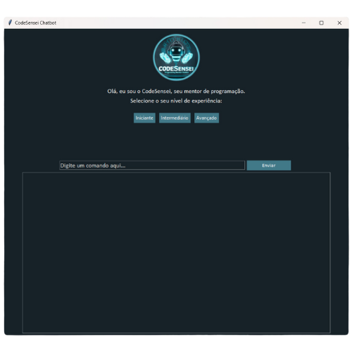
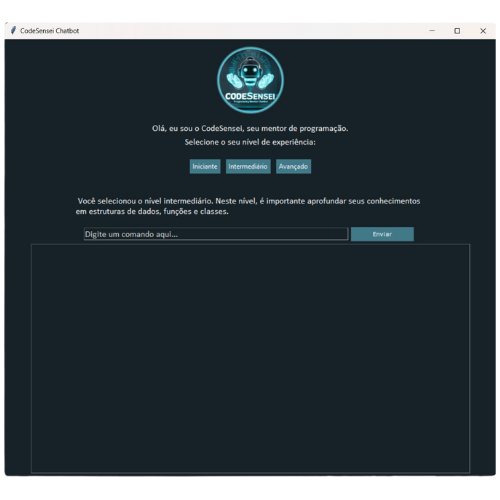
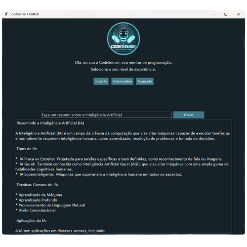

# CodeSensei Chatbot


**CodeSensei Chatbot** é um assistente de programação desenvolvido durante a Imersão IA da Alura + Google. Utilizando Python e a API de IA do Google, oferece respostas inteligentes e contextualizadas para desenvolvedores de todos os níveis.

### Funcionalidades

- **Assistência Personalizada:** Respostas ajustadas ao nível de experiência do usuário (iniciante, intermediário ou avançado).
- **Integração com IA do Google:** Respostas inteligentes via API do Google.
- **Interface Gráfica com Tkinter:** Experiência de usuário intuitiva.

### Exemplo de Execução

1. **Tela Inicial:**

   

2. **Seleção de Nível de Experiência:** Escolha entre iniciante, intermediário ou avançado.

   

3. **Pergunta ao Chatbot:** Insira sua dúvida e receba uma resposta.

   

---

### Instruções de Uso

1. Clone este repositório.
2. Instale o Python e crie um ambiente virtual:
    ```bash
    python -m venv venv
    ```
3. Ative o ambiente:
    - Windows: `venv\Scripts\activate`
    - macOS/Linux: `source venv/bin/activate`
4. Instale as dependências:
    ```bash
    pip install -r requirements.txt
    ```
5. Substitua `'COLE_SUA_API_KEY_AQUI'` no arquivo `chatbot.py` pela sua chave de API do Google.
6. Execute o script:
    ```bash
    python chatbot.py
    ```

---

Criado por Aryane Andrade - 2024
