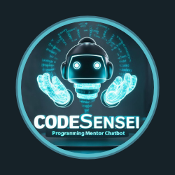

### CodeSensei Chatbot

---

Olá, bem-vindo ao CodeSensei Chatbot! Este é um projeto desenvolvido durante a Imersão IA da Alura + Google, onde aprendi a criar um chatbot usando Python e integrando-o com a API de IA do Google.

### Sobre o Projeto

O CodeSensei Chatbot é um assistente de programação que visa ajudar desenvolvedores de todos os níveis de experiência a obterem respostas para suas dúvidas e orientações sobre tópicos relacionados à programação.

### Funcionalidades Principais

- **Assistência Personalizada:** O chatbot oferece assistência personalizada de acordo com o nível de experiência do usuário, fornecendo dicas e recomendações relevantes.
  
- **Integração com IA do Google:** Utiliza a poderosa API de IA do Google para responder às perguntas dos usuários de forma inteligente e contextualizada.
  
- **Interface Gráfica Amigável:** A interface foi desenvolvida usando Tkinter, proporcionando uma experiência de usuário intuitiva e fácil de usar.

### Utilização

1. **Selecione seu Nível de Experiência:** Escolha entre os níveis de iniciante, intermediário ou avançado. A partir do nível de experiência selecionado, o chatbot oferecerá orientações e sugestões de aprendizado adicionais. 
  
2. **Digite sua Pergunta:** Insira sua pergunta ou comando no campo de texto e clique em "Enviar" para receber uma resposta do chatbot.

### Comece Agora

Não importa se você está começando sua jornada de programação ou se é um desenvolvedor experiente, o CodeSensei Chatbot está aqui para ajudar você a alcançar seus objetivos de programação. Experimente agora mesmo!

--- 

#### Instruções de Uso para Desenvolvedores

Para executar o **CodeSensei Chatbot** em seu ambiente local, siga estas instruções: 

1. Clone este repositório em sua máquina local. 

2. Certifique-se de ter o Python instalado em seu sistema. 

3. Crie um ambiente virtual usando o comando `python -m venv venv`. 

4. Ative o ambiente virtual: 

    - No Windows: `venv\Scripts\activate` 

    - No macOS e Linux: `source venv/bin/activate` 

5. Instale as dependências do projeto executando `pip install -r requirements.txt`. 

6. Substitua `'COLE_SUA_API_KEY_AQUI'` em `GOOGLE_API_KEY` com sua chave de API do Google. 

7. Execute o script `chatbot.py` usando o Python. 
--- 

Criado com ❤️ por [Aryane Andrade] - [2024]
 
